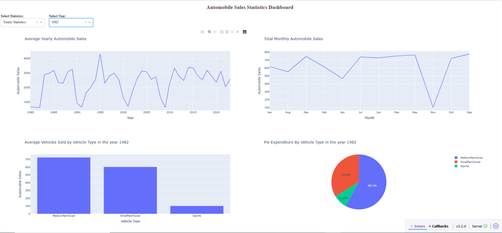
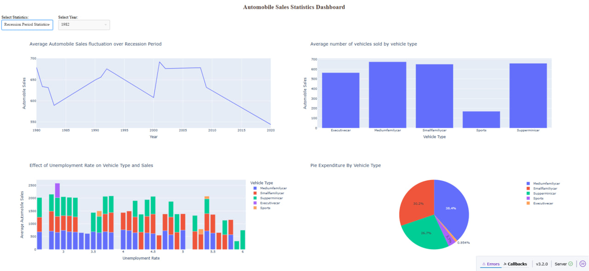
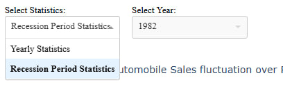
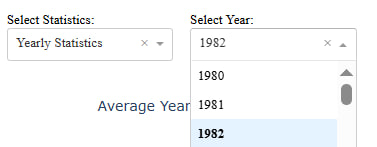

# Car Sales Trends

## Опис проекту
Маємо датасет з продажами автівок з 1980 по 2023. Задача проаналізувати історичні дані і продемонструвати, як змінювалися тенденції продажів під час звичайних періодів та економічних спадів (рецесій). 

## Етапи 
- Створення макет інтерфейсу через компоненти html.
- Реалізація callback функцій для оновлення візуалізацій відповідно до вибору користувача.
- Побудова графіків з використанням модуля plotly.express.
- Ініціалізація Dash-додатку.
- Запуск локального сервера для відображення дашборду.

## Інструменти
Python, Dash, Plotly

## Результат
- Створено веб-додаток, який у локальному середовищі забезпечує обробку даних на Dash-сервері та їхню інтерактивну візуалізацію у браузері.
- Реалізувати можливість вибору між двома режимами: Щорічна статистика (Yearly Statistics) та Статистика у періоди рецесій (Recession Period Statistics).
- Для режиму Статистика у періоди рецесій (Recession Period Statistics) створити випадаюче мені з наявними роками.
- Побудовано 4 графіки, що відображають ключові тенденції продажів і фактори, які на них впливають.

